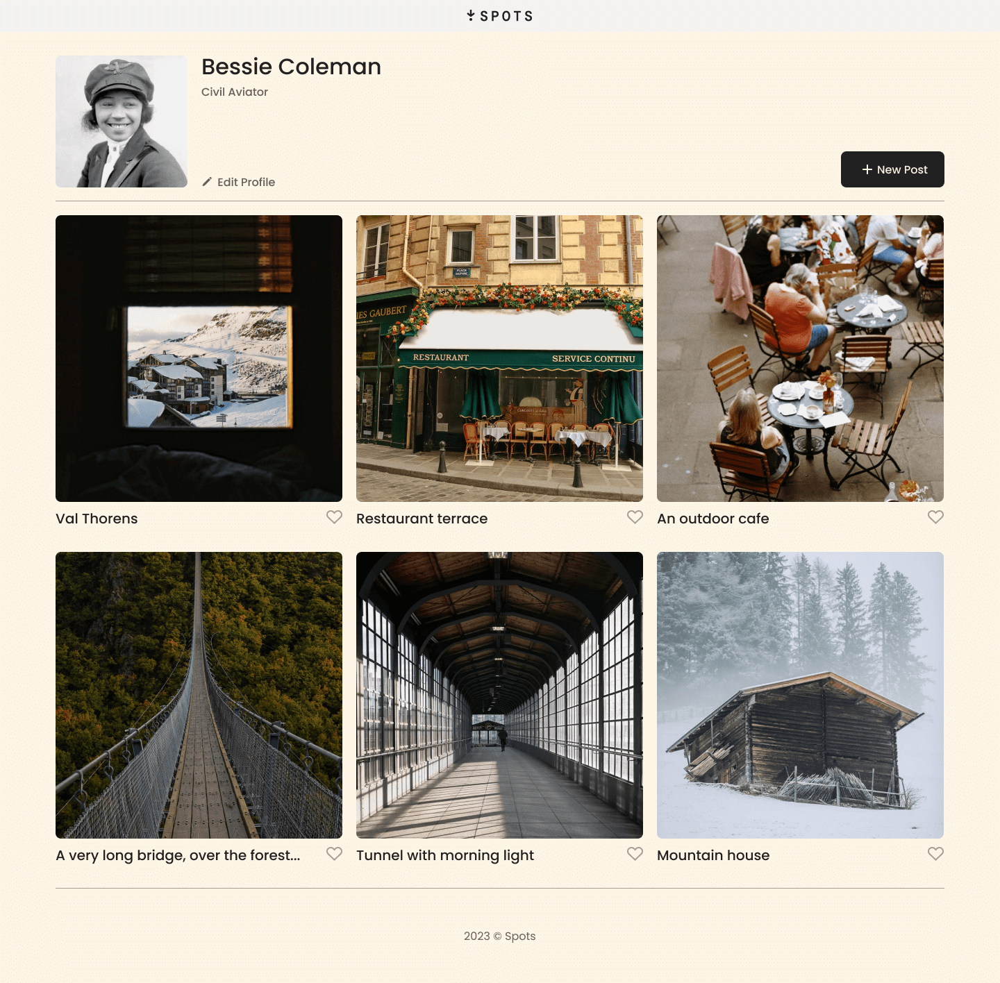
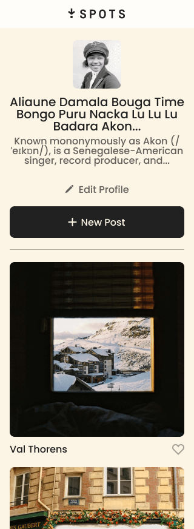

# Project 3: Spots

An Image sharing site.

## Description

This project is made so all the elements are displayed correctly on popular screen sizes. This webpage is responsive and allows users to post images.

### Overview

- Intro
- Figma
- Images
- Deployment
- About the Project Video
- Future Updates

**Intro**

This project is made so all the elements are displayed correctly on popular screen sizes. This webpage is responsive and allows users to post images.

**Figma**

- [Link to the project on Figma](https://www.figma.com/file/BBNm2bC3lj8QQMHlnqRsga/Sprint-3-Project-%E2%80%94-Spots?type=design&node-id=2%3A60&mode=design&t=afgNFybdorZO6cQo-1)

**Images**

Example of the Desktop view at 1440px:

Example of the Desktop view and Name overflow at 1440px:
![Desktop View and Name Overflow] (./images/demo/Spots App 1440px Name Overflow.png)
Example of the Mobile Version:

**Deployment**

This webpage is deployed to GitHub Pages

- [Deployment Link:](https://lstapleton02.github.io/se_project_spots/) https://lstapleton02.github.io/se_project_spots/

**About the Project**

Please see a detailed video description about the project and my process behind the code.

- [Video Link:]https://drive.google.com/file/d/1Kw_M8gi_NswcMmeINAxfW2gJAe35R-XW/view?usp=drive_link

**Future Updates**

Eventually will add javascript elements. Make buttons active.
